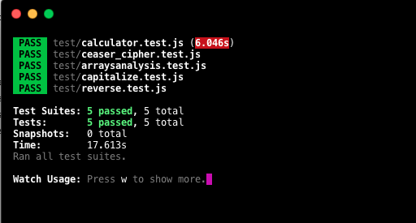

[![Contributors][contributors-shield]][contributors-url]
[![Forks][forks-shield]][forks-url]
[![Stargazers][stars-shield]][stars-url]
[![Issues][issues-shield]][issues-url]
[![MIT License][license-shield]][license-url]

# Project-testing-practice

 

  

  <h3 align="center">
    A project from the Microverse Javascript Curriculum
  </h3>

  

 This project comes from the testing practice part of the <a href="https://www.theodinproject.com/courses/javascript/lessons/testing-practice">Odin project curriculum.</a>
     

  

## Project: Testing Practice

This project involves using the Jest testing framework to write tests for a couple of basic functions. It is a practice project to test five functions which include:

- capitalize(string) function
- reverseString(string) function
- calculator factory function
- ceasarCipher function
- Array Analysis function

## Snapshot

# Test

- JEST

# Validations

- ESLINT

# Get Started

- Download or clone this [repo here](https://github.com/alexawesomecode/project-testing-practice) 
- Run `npm install` to install project dependency if you have npm pre-installed.
- Run `npm run test` to run tests.

# Built With

This project was built with these techologies:

* JAVASCRIPT
* BABEL
* HTML
* CSS3
* JEST

# Authors

**Michgolden Ukeje**

- Github: [@mikenath223](https://github.com/mikenath223)
- Twitter: [@Michgolden_Nath](https://twitter.com/MichgoldenU)
- Linkedin: [Ukeje Michgolden](https://https://www.linkedin.com/in/michgoldenukeje/)
 
 

**Alejandro Andres**

- Github: [@alexawesomecode](https://github.com/alexawesomecode)
- Twitter: [@alexcode0](https://twitter.com/alexcode0)
- Linkedin: [Alejandro Andres](https://www.linkedin.com/in/alejandro-andres-126592191/)

# License

This project is licensed under the MIT License - see the [LICENSE.md](LICENSE.md) file for details

<!-- ACKNOWLEDGEMENTS -->
## Acknowledgements
* [Microverse](https://www.microverse.org/)
* [The Odin Project](https://www.theodinproject.com/)

<!-- MARKDOWN LINKS & IMAGES -->
<!-- https://www.markdownguide.org/basic-syntax/#reference-style-links -->
[contributors-shield]: https://img.shields.io/github/contributors/alexawesomecode/project-testing-practice.svg?style=flat-square
[contributors-url]: https://github.com/alexawesomecode/project-testing-practice/graphs/contributors
[forks-shield]: https://img.shields.io/github/forks/alexawesomecode/project-testing-practice
[forks-url]: https://github.com/alexawesomecode/project-testing-practice/network/members
[stars-shield]: https://img.shields.io/github/stars/alexawesomecode/project-testing-practice
[stars-url]: https://github.com/alexawesomecode/project-testing-practice/stargazers
[issues-shield]: https://img.shields.io/github/issues/alexawesomecode/project-testing-practice
[issues-url]: https://github.com/alexawesomecode/project-testing-practice/issues
[license-shield]: https://img.shields.io/github/license/alexawesomecode/project-testing-practice
[license-url]: https://github.com/alexawesomecode/project-testing-practice/blob/master/LICENSE.txt
